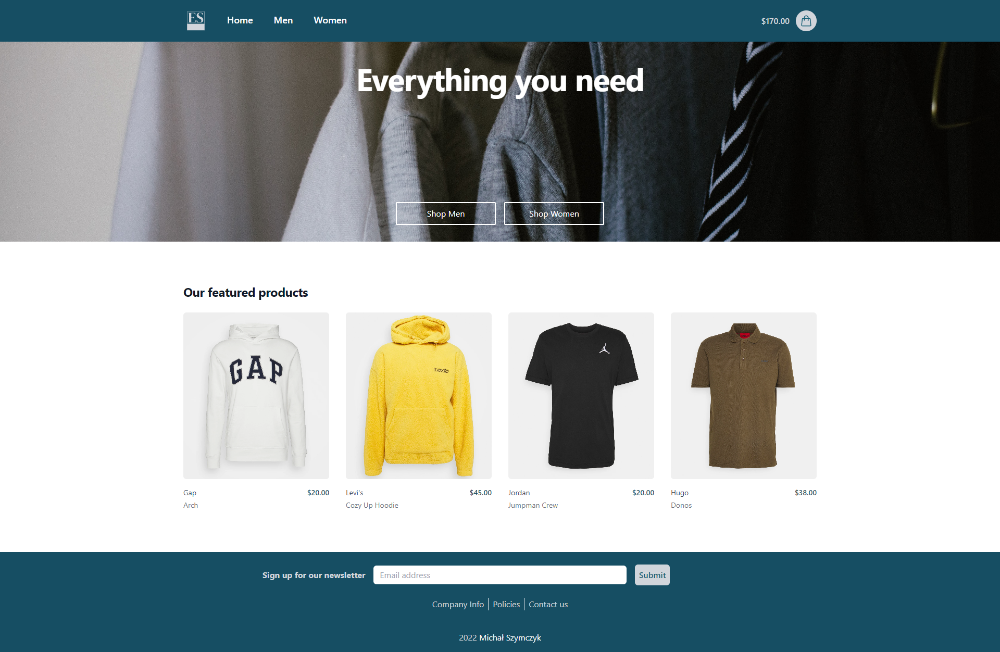
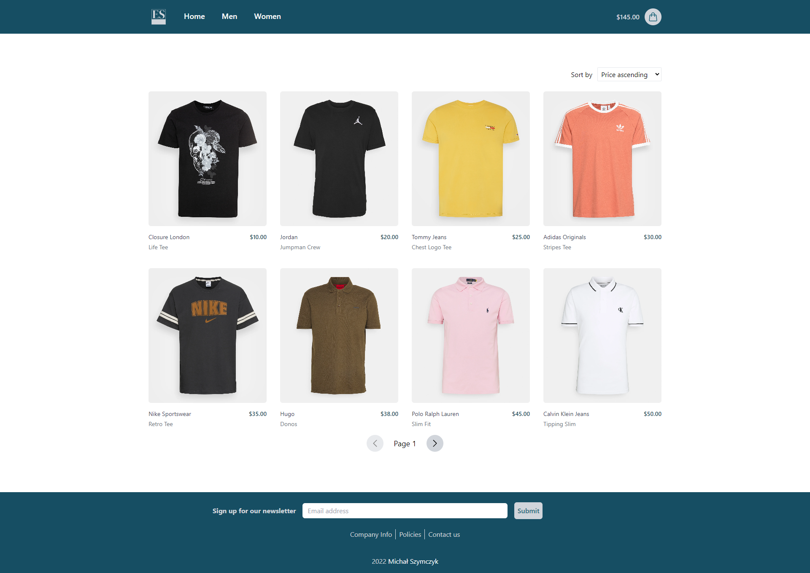
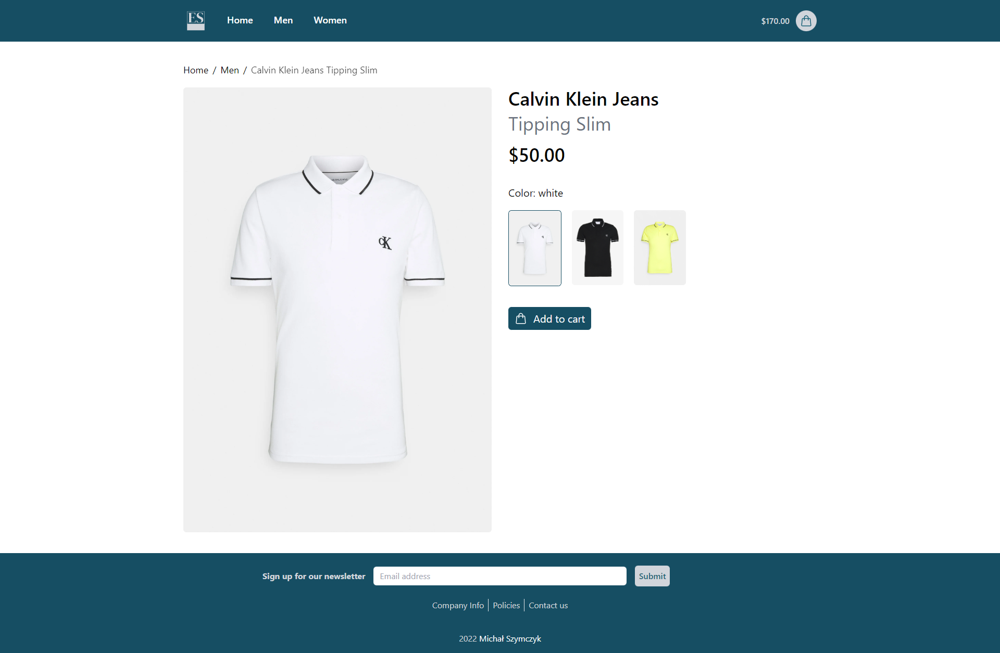
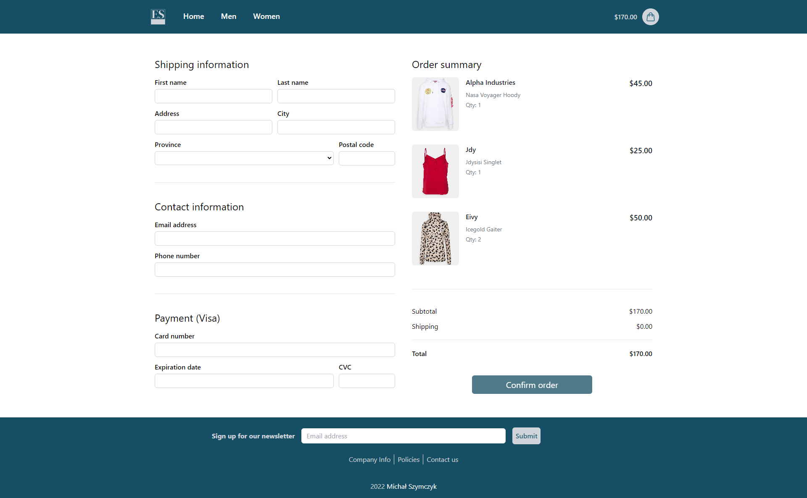

  

<h1>ElegantStore - Online Ecommerce Project</h1>
<h3> Technologies used: </h3>
<h4>:eye: Frontend: </h4>
<ul>
  <li>
    <a href="https://github.com/angular">Angular</a>
  </li>
  <li>
    <a href="https://github.com/tailwindlabs/tailwindcss">Tailwind CSS</a>
  </li>
  <li>
    <a href="https://github.com/tailwindlabs/heroicons">Heroicons</a>
  </li>
</ul>
<h4>:wrench: Backend: </h4>
<ul>
  <li>
    <a href="https://github.com/dotnet/aspnetcore">ASP.NET Core Web Api</a>
  </li>
  <li>
    <a href="https://github.com/dotnet/efcore">Entity Framework Core</a>
  </li>
  <li>
    <a href="https://github.com/ardalis/Specification">Ardalis Specification</a>
  </li>
  <li>
    <a href="https://github.com/ardalis/GuardClauses">Ardalis GuardClauses</a>
  </li>
  <li>
    <a href="https://github.com/xunit/xunit">xUnit</a>
  </li>
  <li>
    <a href="https://github.com/nsubstitute/NSubstitute">NSubstitute</a>
  </li>
  <li>
    <a href="https://github.com/fluentassertions/fluentassertions">Fluent Assertions</a>
  </li>
  <li>
    <a href="https://github.com/MapsterMapper/Mapster">Mapster</a>
  </li>
</ul>
<h3>Getting started:</h3>
<ol>
  <li>
    Clone repository:
    <kbd>git clone https://github.com/Zimeek/ElegantStore.git</kbd>
  </li>
  <li>
    Install packages:
    <kbd>cd src/ElegantStore.Web</kbd> -> <kbd>npm install</kbd>
  </li>
  <li>
    Run Angular app:
    <kbd>ng serve</kbd>
  </li>
  <li>
    Run Web Api:
    <kbd>cd src/ElegantStore.Api</kbd> -> <kbd>dotnet build</kbd> -> <kbd>dotnet run</kbd>
  </li>
  <li>
    Open browser on:
    <kbd>http://localhost:4200/</kbd>
  </li>
</ol>
<h3>Gallery:</h3>

